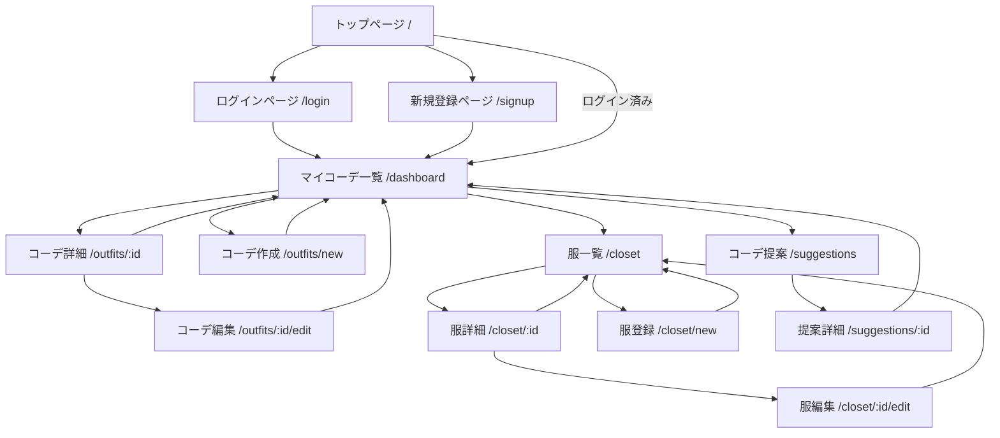

# coordinator
## 実装すべき機能について

### ユーザ関連機能
- ユーザの登録・ログイン・ログアウト

### 衣服関連機能
- ユーザが所有している服を登録する機能
- 服のカテゴリ分類
- タグづけ機能
- 季節ごとの分類
- 用途ごとの分類
- 一覧の作成
- 持っていないが似合いそうな服の提案
- SNS共有機能

### コーディネート関連機能
- 登録された服を組み合わせて良いコーデを提案
- シーンに合わせたコーデ提案
- 天気に合わせたコーデ提案
- 季節に応じたコーデ提案
- お気に入りのコーデの保存
- コーディネートの名前をつける
- コーディネートにメモをつける
- 所持していない服からもコーデを提案する（モード切り替えによる）
- 過去にしたコーデを記録して重複を避ける
- カレンダーや日付に紐づけて管理
- 一覧の作成
- 作成提案
- 似合いそうな服の提案
- SNS共有機能

## 技術スタック
### フロントエンド
- UI構築
- ページルーティング
- API呼び出し
- 画像アップロード画面などの操作UI

### バックエンド
- ユーザ認証（Devise + JWTなど）
- 衣服データ、コーディネートデータの管理
- コーデ提案ロジック
- データベースの操作（Active Record）

### データベース
- PostgreSQL
- 衣服、ユーザ、コーディネートなどのテーブル

### 画像保存
- Cloudinary や AWS S3（Next.js → Rails → Cloudにアップロード）

### 認証・セキュリティ
- Rails側：Devise + devise-jwt でトークンベースの認証
- Next.js側：ログイン時にJWTを取得 → Authorization: Bearer xxx ヘッダーでAPI通信

## データベース設定
### ユーザ
| 項目名 | 型 | 説明 |
| --- | --- | --- |
| id | `String` |　ユーザID　|
| name | `String` | ユーザ名 |
| email | `String` | メールアドレス |
| password | `String` | パスワード |

### 服
| 項目名 | 型 | 説明 |
| --- | --- | --- |
| id |  | 服ID |
| user_id |  | ユーザID |
| name |  | 服の名前 |
| image_url |  | 服の画像URL |
| category |  |  |
| color |  |  |
| season |  |  |
| tags |  |  |
| created_at |  |  | 
| updated_at |  |  |

### コーディネート
| 項目名 | 型 | 説明 |
| --- | --- | --- |
||||
||||
||||
||||
### コーディネートを構成する服
| 項目名 | 型 | 説明 |
| --- | --- | --- |
||||
||||
||||
||||
### お気にのコーデ

## APIエンドポイント設計
### Rails側
| パス | メソッド | 説明 |
| --- | --- | --- |
| `/api/signup` | POST | ユーザ登録 |
| `/api/login` | POST | ログイン（JWT発行） |
| `/api/profile` | GET | 自分のユーザデータを取得（認証を要求） |
| `/api/clothing` | GET | 自分の衣服一覧 |
| `/api/clothing/:id` | GET | 衣服詳細 |
| `/api/clothing` | POST | 衣服の新規登録 |
| `/api/clothing/:id` | PUT/PATCH | 衣服の編集 |
| `/api/clothing/:id` | DELETE | 衣服の削除 |
| `/api/outfits` | GET | 自分のコーデ一覧 |
| `/api/outfits/:id` | GET | コーデ詳細 |
| `/api/outfits` | POST | コーデの作成 |
| `/api/outfits/:id` | PUT/PATCH | コーデの編集 |
| `/api/outfits/:id` | DELETE | コーデの削除 |
| `/api/suggestions` | GET | 自動コーデ提案一覧（ルールベース or AI） |
| `/api/suggestions/:id` | GET | 提案されたコーデ詳細 |
| `/api/suggestions/:id/save` | POST | 提案コーデをお気に入りに保存（Outfitとして登録） |

https://chatgpt.com/share/67f45c47-b4ec-8009-bb6a-933b49de815c